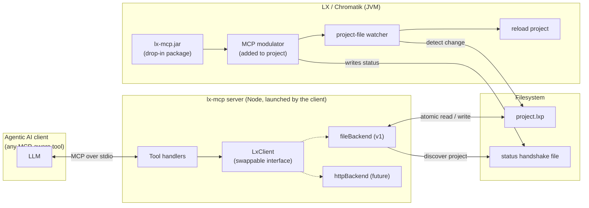
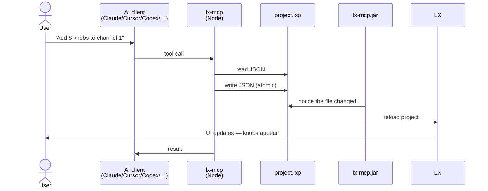

# lx-mcp

> **Status**: design draft. No code yet — this README captures the architecture before implementation. Tested against LX 1.2.x.

A bridge that lets any agentic AI client (Claude, Cursor, Codex, Zed, Continue, …) help you set up an [LX](https://github.com/heronarts/LX) / [Chromatik](https://chromatik.co) show — adding channels and patterns, wiring up modulation knobs/buttons/triggers, routing modulators to parameters, and creating MIDI mappings — while you watch it happen live in the Chromatik UI. Built on Anthropic's [Model Context Protocol](https://modelcontextprotocol.io/).

This is **not** an official LX/Chromatik extension. It's an independent package that ships as a drop-in LX jar; LX's existing package system loads it without any upstream changes.

## What you do

1. Drop `lx-mcp.jar` into LX's packages folder.
2. Open a project. A new "MCP" modulator appears in the modulator menu next to MacroKnobs, MacroSwitches, etc.
3. Drop the MCP modulator into the project. That single act opts this project into AI editing.
4. Open any MCP-aware AI client (Claude Desktop, Cursor, Codex CLI, …), install the `lx-mcp` server (see [`docs/install/`](docs/install/)), and ask it to do something:
   - *"Add 8 macro knobs and wire knob 1 to channel 1's brightness."*
   - *"Map MIDI CC 7 on channel 1 to the master fader."*
   - *"Add a pattern bank with three patterns on a new channel."*
5. Watch the Chromatik UI update within a second or two as the assistant works.

Remove the modulator (or close the project) → AI editing turns off for that project. Present = on, absent = off.

## Architecture



Two processes, talking through the filesystem:

- **lx-mcp** (a small Node MCP server, [`server/`](server/)) is what your AI client launches. It exposes the tool surface and serializes intents — *add a channel, add a macro knob, wire this to that, add a MIDI mapping* — into edits on the project JSON.
- **lx-mcp.jar** ([`package/`](package/)) is the in-LX half: a package that contributes the MCP modulator. When the modulator is active in a project, it advertises that project via a small status file in `~/.lx-mcp/` and reloads the project when the JSON changes on disk.

The status file is the entire handshake. No sockets, no daemons, no setup.

## A tool call, end-to-end



## What the AI can edit

Tools are intent-shaped — the AI says what to do, the Node server figures out the JSON. Coverage:

- **Mixer**: list / add / remove channels, set channel parameters.
- **Patterns**: add patterns to a channel, set the active pattern, set pattern parameters.
- **Modulation side panel**: add MacroKnobs / MacroSwitches / MacroTriggers, add LFOs and envelopes, wire any modulator to any parameter, wire any trigger source to any trigger target.
- **MIDI mappings**: list, add, remove.
- **Parameters**: set any parameter by its canonical path.

Parameter paths follow LX's existing OSC address convention, so the same identifiers work whether the AI is editing the file or (later) hitting a live HTTP endpoint.

## Future direction

The Node server's communication layer is a swappable interface. v1 implements it against the project file (write, then watch reloads). A future v2 can implement it against a live HTTP endpoint hosted by the same modulator — same tool surface, no client-side changes, no reload pause, no loss of in-progress UI state. A v3 could front the same HTTP from a different machine.

## Trade-offs

- **Reloading the project resets transient runtime state** (pattern transition position, undo stack). Acceptable for authoring; the HTTP follow-up eliminates this.
- **Autosave / reload echo**: the watcher ignores changes LX just wrote itself, via timestamp gating.
- **File-system latency on macOS**: Java's `WatchService` can lag; the watcher falls back to short-interval mtime polling if needed.
- **Schema drift across LX versions**: the Node server refuses to edit a project whose version it doesn't recognize, rather than silently corrupting it.

## Repo layout

```
lx-mcp/
  package/                # Java — the drop-in jar (Maven)
    src/main/java/...     # MCP modulator, watcher, status file writer
    pom.xml
  server/                 # Node/TypeScript — the MCP server
    src/
      cli.ts
      server/lxMcpServer.ts
      transport/          # stdio + streamable-http
      features/tools/     # tool handlers + Zod schemas
      lxClient/           # swappable backend (file / http / remote)
    package.json
    mcpb/                 # Claude Desktop bundle manifest
  docs/
    install/              # per-client install snippets
      claude-desktop.md
      claude-code.md
      cursor.md
      codex.md
```

## Status

Empty skeleton — implementation hasn't started. See [`docs/`](docs/) for design notes as they accumulate.

## License

TBD.
